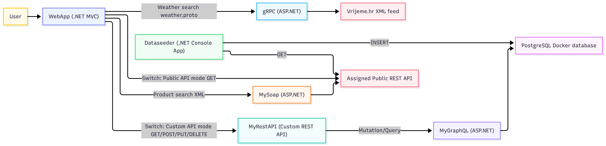
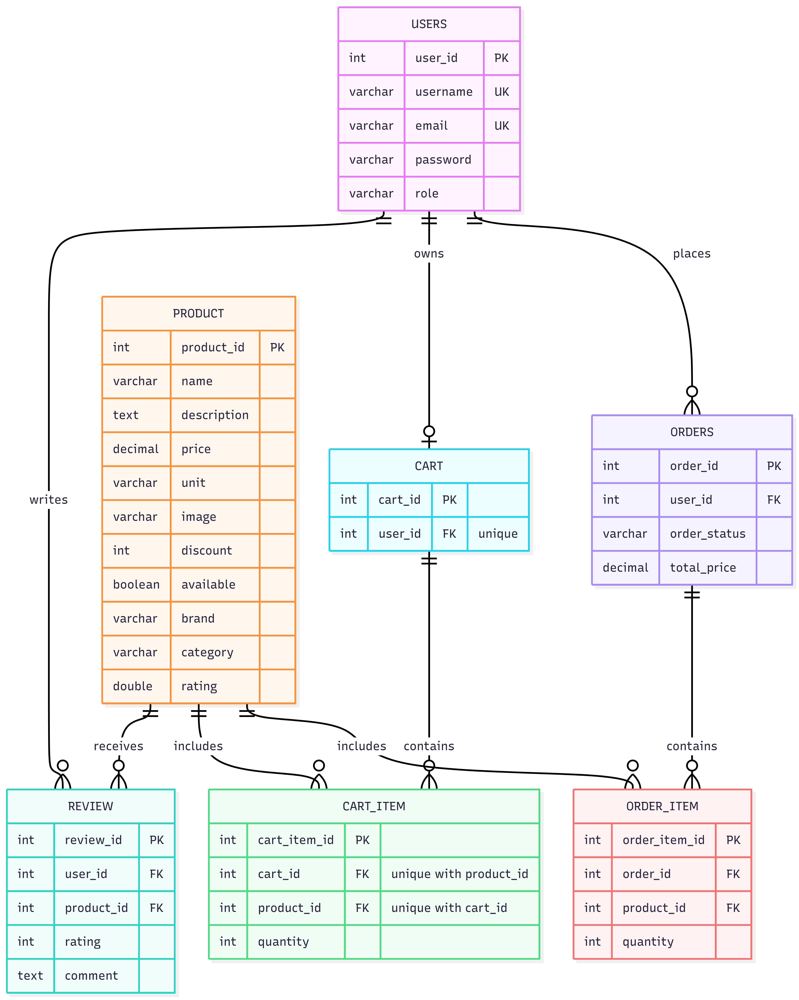

# Fakestore project for "Interoperability of information systems" course

Fakestore project for the "Interoperability of information systems" that implements MVC, Rest API, GraphQL API, SOAP API and PostgreSQL database

*Course assigned Public REST API*: https://app.beeceptor.com/mock-server/fake-store-api

## Projects

### Models
Models that will be used for storing the data in the PostgreSQL database

### ViewModels
ViewModels that will be used for retriving data from my own Rest API implemetation and assigned Public REST API.

### Dataseeder (.NET Console App)
Gets data from course assigned Public API to be inputs it into PostgreSQL

### MyGraphQL (ASP.NET)
A GraphQL API server for Queries and Mutates data from the PostgreSQL database

### MyRestAPI (ASP.NET) [name: Custom API]
A REST API server for Authenticating users, GET-ing, POST-ing, PUT-ing and DELETING-ing data. It is a wrapper for MyGraphQL project.
- Authentication controller is fully public and it is used to get the JWT token that contains the proper role
- "read-only" role can only access GET endpoints
- "full access" role can access all endpoints

### gRPC (ASP.NET)
A gRPC server for fetching the data from public weather information in an .xml format [Vrijeme.hr croatia](https://vrijeme.hr/hrvatska_n.xml), it allows search by city name

### MySoap (ASP.NET)
A SOAP API server for fetching Product data from assigned Public API and has an endpoint for searching for Products
- Verifies the XML data that it already has stored
- On start it fetches the data from the Public API
- Initializes the endpoint for searching products by "keyword", "Minimal price" and "Maximum price" 

### WebApp (.NET MVC)
- Weather search page
- Product search from SOAP interface
- Switch between Public API and Custom API
    - Public API
        - Will use all the GET endpoints from the Public API to fetch data and list them
    - Custom API
        - Support Login and Registration
        - JWT token implementation 
        - Read-only users can read data
        - Full access users can read, create, modify and delete data

### PostgreSQL (Docker)
- Stores all the data that will be read by GraphQL
- Tables:
    - Users
    - Products
    - Reviews
    - Cart
    - CartItem
    - Order
    - OrderItem

